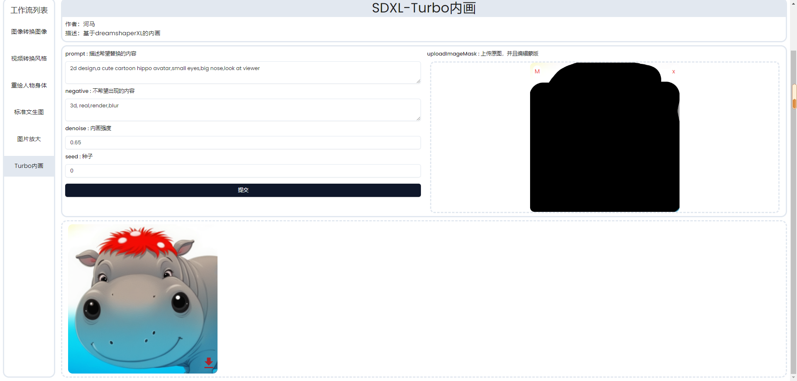
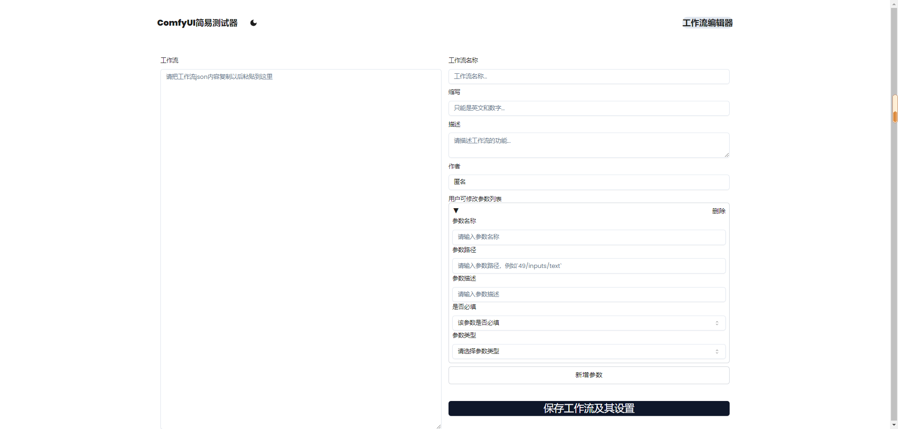

The purpose of this project is to use the API files exported by comfyUI to allow users to customize the exposed parameters and create a more concise and user-friendly interface for comfyUI.

## Installation and Running

Installation:

```bash
npm install
```

Running：

```bash
npm run dev
```

## Setting Environment Variables

Copy `.env.example` and rename it to `.env.local`. Replace the value of `NEXT_PUBLIC_SERVER_ADDRESS` with your actual ComfyUI server address.

## Usage

Open your browser and visit [http://localhost:3000](http://localhost:3000) to access the simplified ComfyUI interface generated based on your settings.



visit [http://localhost:3000/workflow](http://localhost:3000/workflow) to access the workflow editing and setting editor.



## Other Notes

This project does not have a backend, so after editing and setting up the workflow, clicking save will only generate a JSON file. To see the changes, copy the contents of the JSON file and paste them into `public/workflow/sdxl_img2img_setting.json`, then refresh `http://localhost:3000`.
